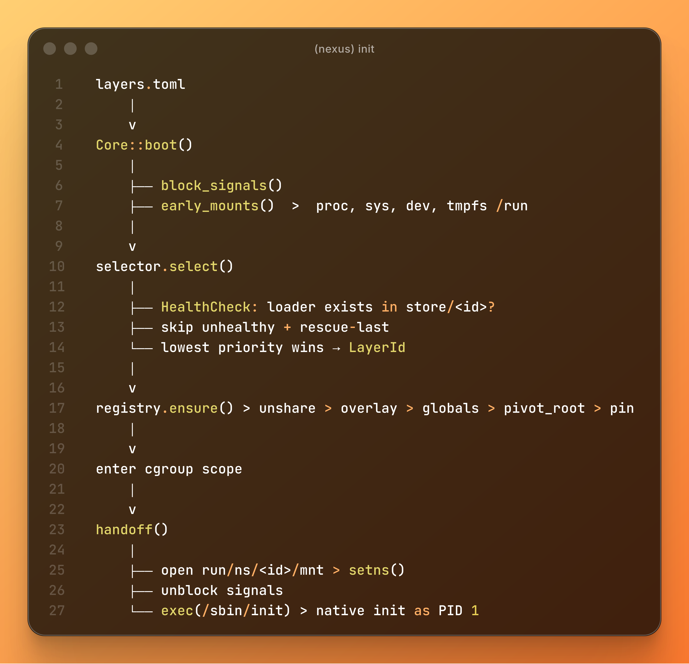
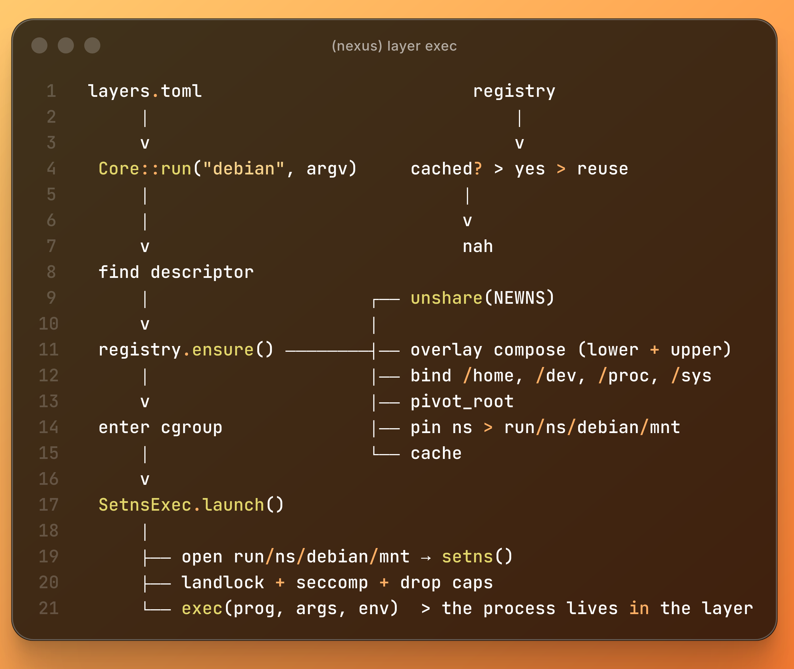

# nexus

core for meta-distributions. pure mechanism: no fuse, no path rewriting, 
no per-distro branching. layers are composed from a content-addressed
store with kernel primitives alone (mount namespaces, overlay, erofs, idmapped
mounts, landlock, seccomp, cgroup v2), then run or booted as pid 1

## docs

https://sqmrak.github.io/nexus

## thanks

https://github.com/bedrocklinux/bedrocklinux-userland

## license

GPL-2.0-only
